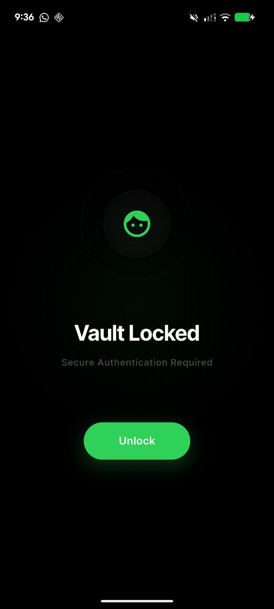
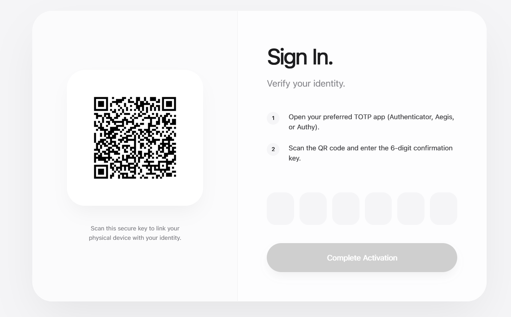
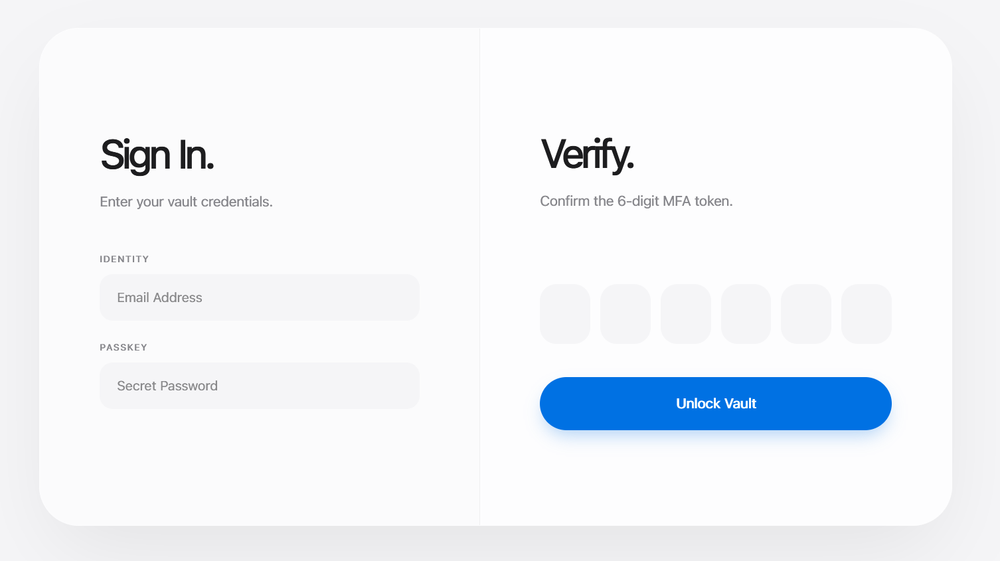

# Fortyl — Secure Authentication Platform

Fortyl is a modern authentication platform that provides Email & Password login, JWT-based sessions, and Time-based Multi-Factor Authentication (TOTP) using authenticator apps — built with security, clarity, and extensibility in mind.
Unlike standalone authenticator apps, Fortyl combines backend-driven authentication logic with client-side MFA, making it suitable for real-world applications, enterprise systems, and security-focused products.

---

## Why Fortyl?

Authentication systems are often either:
* **Too simple** — password-only login with weak security
* **Too fragmented** — MFA handled separately with no backend awareness
* **Hard to extend** — tightly coupled, hard to reason about

Fortyl solves this by treating authentication as a first-class platform.

---

## Problem

Modern applications require strong authentication, but developers face several challenges:
* Password-only authentication is insecure
* MFA is often bolted on as an afterthought
* OTP apps are device-bound, not account-aware
* No visibility into MFA state during login
* Hard to manage sessions, re-logins, and MFA verification
* Frontend and backend MFA logic are often disconnected

As a result, systems become hard to scale, hard to audit, and hard to trust.

---

## Solution

Fortyl provides a clean, backend-driven authentication flow:
* Email + Password authentication with BCrypt hashing
* JWT-based stateless session management
* TOTP-based MFA using industry-standard OTP algorithms
* Backend-controlled MFA lifecycle (Enroll → Confirm → Verify)
* QR-based MFA enrollment
* Clear separation of concerns across backend, mobile, and web
* Designed for future extensions (Redis, Kafka, device trust, risk scoring)

---

## Core Features

### Authentication
* Email & password login
* BCrypt password hashing
* JWT token generation
* MFA-aware login flow

### Multi-Factor Authentication (MFA)
* TOTP-based MFA (RFC 6238 compatible)
* QR code enrollment
* Google Authenticator / Aegis Authenticator compatible
* Backend-side OTP verification
* 30-second rolling codes
* MFA state management (PENDING → ACTIVE)

### Client Support
* Flutter-based authenticator app
* Web-based login & QR enrollment (Next.js)
* API-driven flows

### Architecture
* Modular Spring Boot backend
* Clean REST APIs
* Database-backed MFA state
* Stateless authentication using JWT

---

## Repository Structure

```text
Fortyl/
│
├── Backend/
│   ├── auth-core/
│   │   ├── src/main/java/com/Fortyl/auth/
│   │   │   ├── controller/
│   │   │   │   ├── AuthController.java
│   │   │   │   ├── MfaController.java
│   │   │   │   └── HealthController.java
│   │   │   │
│   │   │   ├── service/
│   │   │   │   ├── AuthService.java
│   │   │   │   ├── MfaService.java
│   │   │   │   ├── JwtService.java
│   │   │   │   └── PasswordService.java
│   │   │   │
│   │   │   ├── entity/
│   │   │   │   ├── User.java
│   │   │   │   └── MfaSecret.java
│   │   │   │
│   │   │   ├── repository/
│   │   │   │   ├── UserRepository.java
│   │   │   │   └── MfaSecretRepository.java
│   │   │   │
│   │   │   ├── dto/
│   │   │   │   ├── LoginRequest.java
│   │   │   │   ├── LoginResponse.java
│   │   │   │   ├── MfaEnrollResponse.java
│   │   │   │   └── MfaVerifyRequest.java
│   │   │   │
│   │   │   ├── security/
│   │   │   │   ├── SecurityConfig.java
│   │   │   │   ├── JwtFilter.java
│   │   │   │   └── PasswordEncoderConfig.java
│   │   │   │
│   │   │   ├── util/
│   │   │   │   ├── QrCodeUtil.java
│   │   │   │   └── TotpUtil.java
│   │   │   │
│   │   │   └── FortylApplication.java
│   │   │
│   │   ├── src/main/resources/
│   │   │   └── application.yml
│   │   │
│   │   ├── Dockerfile
│   │   └── pom.xml
│
├── Frontend/
│   ├── flutter-app/
│   │   ├── lib/
│   │   │   ├── screens/
│   │   │   │   ├── enroll_qr.dart
│   │   │   │   ├── otp_list.dart
│   │   │   │   ├── otp_verify.dart
│   │   │   │   └── settings.dart
│   │   │   │
│   │   │   ├── services/
│   │   │   │   └── mfa_service.dart
│   │   │   │
│   │   │   ├── models/
│   │   │   │   └── otp_account.dart
│   │   │   │
│   │   │   └── main.dart
│   │   │
│   │   └── pubspec.yaml
│
├── Web/
│   ├── Fortyl-web/          # Next.js App
│   │   ├── pages/
│   │   │   ├── login.tsx
│   │   │   ├── enroll.tsx
│   │   │   ├── verify.tsx
│   │   │   └── dashboard.tsx
│   │   │
│   │   ├── components/
│   │   │   ├── QrViewer.tsx
│   │   │   ├── OtpInput.tsx
│   │   │   └── SecureButton.tsx
│   │   │
│   │   ├── services/
│   │   │   └── api.ts
│   │   │
│   │   └── next.config.js
│
├── docs/
│   ├── architecture.md
│   └── auth-flow.md
│
├── docker-compose.yaml
├── README.md
└── LICENSE

```

---

## Authentication Flow

### Login

Email + Password → Backend Validation

### MFA Required?

If MFA ACTIVE → Prompt for OTP
If not → Issue JWT

### MFA Enroll

`/mfa/enroll` → QR Code → Authenticator App Scan

### MFA Confirm

User enters OTP → `/mfa/confirm` → MFA Activated

### MFA Verify (Future Logins)

OTP → `/mfa/verify` → JWT Issued

---

## Flutter App (Authenticator)

The Flutter app acts as a secure OTP generator.

### Screens

* **QR Scan:** Enroll new account
* **OTP List:** Support for multiple accounts
* **OTP Countdown UI:** 30s rolling visual
* **Manual OTP verification**
* **Security settings**

### Design Goals

* Minimal UI
* Fast OTP refresh
* Clear visual countdown
* Account-centric (not device-only)

### Images

 <p align="center">
    
     
    
 </p>

---

## Web App (Next.js)

The web app handles user-facing authentication flows.

### Pages

* **Login:** email + password
* **MFA Enrollment:** QR display
* **MFA Verification:** OTP input
* **Dashboard:** post-login view

### Purpose

* Complements mobile app
* Allows login without mobile device access
* Admin / developer-friendly

### Images

 <p align="center">
     
      

 </p>

---

##  Tech Stack

### Backend

* Java 21
* Spring Boot
* Spring Security
* JPA / Hibernate
* PostgreSQL
* `java-otp` (TOTP generation)
* `ZXing` (QR generation)

### Mobile

* Flutter (Dart)
* Material UI
* Secure local storage

### Web

* Next.js
* TypeScript
* API-based auth flows


---

##  Design Philosophy

Fortyl is built with:

* Explicit state transitions
* Clear authentication contracts
* Backend-first security decisions
* Client simplicity
* Extensibility over cleverness

---

##  Conclusion

Fortyl is not just an MFA demo — it is a full authentication platform foundation.

It demonstrates:

1. Real-world auth flows
2. Security best practices
3. Clean architecture
4. Multi-client support (mobile + web)
5. Scalability-first thinking


